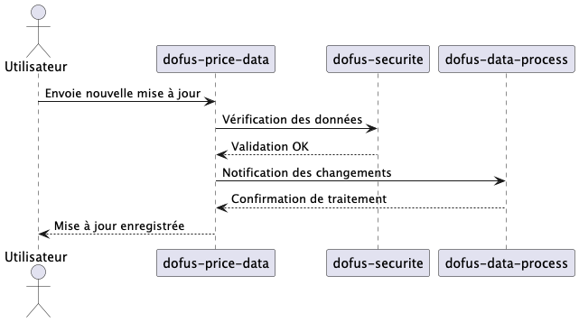
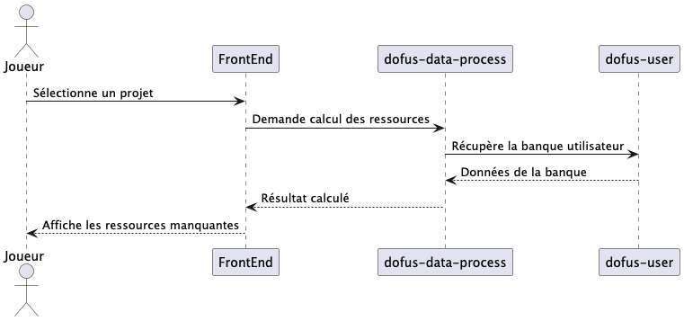

# DofOps - Analyse de marché pour Dofus

---

## Acteurs
- **Joueur Dofus** : Cherche à optimiser son temps et ses bénéfices dans le commerce et la fabrication.
- **Contributeur** : Ajoute du contenu (ressources, données liées aux quêtes).
- **Administrateur** : Supervise les contributions et la sécurité des données.

---

## Objectifs du système
Créer un site communautaire d’analyse de marché pour le jeu *Dofus*, permettant :
- Une gestion optimisée des prix et des ressources.
- Une expérience utilisateur qui facilite les contributions.
- Une analyse automatisée et fiable des données du marché, avec une sécurité renforcée.

Le projet s’appuie sur une architecture en microservices déployée avec Quarkus et Apache Camel.

---

## Microservices

1. **dofus-price-data**
    - Reçoit les mises à jour des prix depuis les utilisateurs.
    - Notifie les autres services des changements de prix.

2. **dofus-securite**
    - Filtre les contributions incorrectes ou abusives (protection contre trolls et DDoS).
    - Sert de passerelle entre les utilisateurs et le microservice de gestion des prix.

3. **dofus-data-process**
    - Centralise le traitement des données du marché.
    - Fournit des API REST pour le front-end.
    - Implémente la logique métier pour les fonctionnalités demandées.

4. **dofus-user**
    - Gère les comptes utilisateurs et leurs permissions.
    - Permet la gestion de "banques" personnelles (stocks de ressources).

---

## Fonctionnalités clés

### Joueur
- Calcul immédiat du coût de fabrication d’un objet.
- Analyse des ressources manquantes pour des projets complexes (panoplies, quêtes).
- Comparaison rapide des prix entre serveurs.

### Contributeur
- Ajout de contenu lié aux quêtes et ressources.
- Enrichissement continu des bases de données communautaires.

### Administrateur
- Gestion des permissions.
- Surveillance des mises à jour critiques du système.

---

## Exigences fonctionnelles

### Prix des objets
- Les prix des objets sont mis à jour en temps réel par les utilisateurs.
- Un mécanisme de validation protège contre les erreurs ou abus.

### Banque utilisateur
- Les utilisateurs inscrits peuvent renseigner leur stock de ressources une fois.
- Les calculs prennent automatiquement en compte leur banque personnelle.

### Quêtes et fabrication
- Calculs des ressources nécessaires pour des quêtes ou fabrications complexes.
- Prise en charge de plusieurs personnages.

---

## Règles métier
- Les prix des objets doivent rester cohérents et réalistes.
- Les contributeurs doivent disposer d’une permission spéciale pour enrichir la base des quêtes.
- Toute modification des prix ou des ressources est validée par le service **dofus-securite**.

---

## Diagrammes de séquence
Les diagrammes de séquence illustrent les principaux cas d'utilisation :

1. **Mise à jour des prix par un utilisateur :**
   

2. **Calcul des ressources manquantes pour un projet :**
   

---

## Technologies et dépendances
- **Framework** : Quarkus 3.15.2
- **Dépendances principales** :
    - Apache Camel Quarkus : camel-quarkus-core, camel-quarkus-jackson, camel-quarkus-sjms2
    - Hibernate ORM
    - MariaDB
    - SmallRye OpenAPI

- **Langage** : Java 21  
