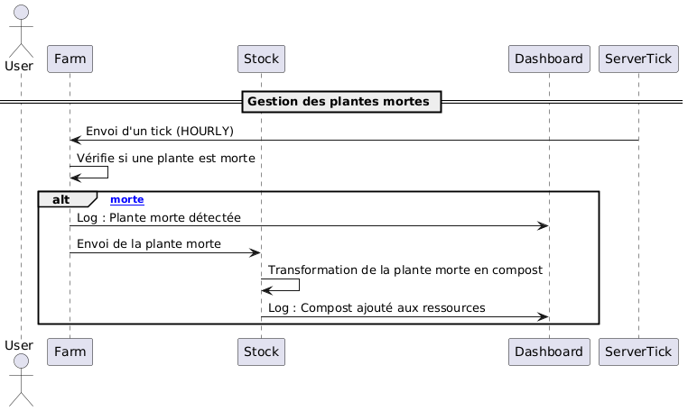

# PlantLazy - README

## Acteurs

### Principaux acteurs :
- **User** : Configure le système et consulte les résultats de la simulation (argent restant, plantes vendues, compost généré, etc.).
- **Dashboard** : Interface principale permettant de superviser et gérer les interactions du système.
- **Farm** : Responsable de la croissance des plantes, de la détection de leur état (croissance, détresse, mort) et de l'envoi des plantes mortes à Stock pour transformation en compost.
- **Store** : Gère les prix, les ventes, l'achat automatique de graines en fonction des fonds disponibles et les interactions liées au commerce.
- **Stock** : Supervise les ressources disponibles (eau, engrais, compost, argent) et transforme les plantes mortes en compost.
- **ServerTick** : Envoie des événements périodiques (tick) pour déclencher les cycles du système (HOURLY ou DAILY).

## Objectifs du système
- Automatiser la gestion d'une ferme virtuelle tout en simulant les aspects économiques et biologiques.
- Permettre une configuration et un suivi facile des performances par l'utilisateur via le tableau de bord.
- Optimiser les ressources disponibles (argent, eau, engrais) pour maximiser les revenus et la productivité de la ferme.

## Microservices
Le projet est basé sur une architecture microservices, comprenant les services suivants :
- **Service Farm** : Suivi de la croissance et de l'état des plantes, envoi des plantes mortes à Stock.
- **Service Store** : Gestion des ventes, définition des prix et achat des graines en fonction des fonds disponibles.
- **Service Stock** : Gestion des ressources (eau, engrais, compost, argent) et transformation des plantes mortes en compost.
- **Service Dashboard** : Interface principale pour la configuration et la supervision.
- **Service ServerTick** : Génération d'événements périodiques (HOURLY pour la gestion des plantes mortes, DAILY pour l'achat de graines) pour synchroniser les actions des autres services.

## Fonctionnalités clés
1. Configuration du budget initial et des paramètres de simulation.
2. Achat automatique de graines déclenché par un tick DAILY de ServerTick et basé sur les fonds disponibles.
3. Suivi de la croissance des plantes et intervention en cas de détresse (eau, engrais, lumière).
4. Gestion des plantes mortes déclenchée par un tick HOURLY de ServerTick et transformation en compost via le service Stock.
5. Vente des plantes à des prix définis dynamiquement par Store.
6. Logs détaillés pour chaque action majeure dans le système.
7. Résumé final de la simulation (argent restant, plantes vendues, compost généré, etc.).

## Exigences fonctionnelles
- Le système doit être capable de gérer les ressources en temps réel selon les événements envoyés par **ServerTick**.
- Les transactions (achats de graines, utilisation de ressources, ventes) doivent être validées selon les règles métier.
- Les plantes doivent passer par plusieurs cycles de croissance jusqu'à la vente ou la mort.
- Les logs doivent être consultables via le **Dashboard** pour un suivi transparent des opérations.

## Règles métier
1. Une plante ne peut croître que si les ressources nécessaires (eau, engrais, lumière) sont disponibles.
2. En cas de mort d'une plante, celle-ci est envoyée à Stock pour transformation en compost.
3. Les graines ne peuvent être achetées que si les fonds sont suffisants.
4. Les ventes de plantes sont soumises aux prix définis par **Store**.
5. Les ressources doivent être mises à jour après chaque transaction ou événement lié à la ferme.

## Diagrammes de séquence
### 1. **Achat de graines**
- Décrit la réception d'un tick DAILY, la demande de fonds disponibles, l'achat et la livraison de graines.
  
### 2. **Croissance des plantes**
- Illustre les cycles de croissance, l'utilisation des ressources, et la gestion des plantes en détresse.
  
### 3. **Gestion des plantes mortes**
- Détaille la réception d'un tick HOURLY, la détection des plantes mortes, leur envoi à Stock, transformation en compost et mise à jour des ressources.
  
### 4. **Vente des plantes**
- Montre la définition des prix, la mise en vente et le crédit des revenus.
  

## Technologies et dépendances

### Framework
- **Quarkus 3.15.2** : Un framework Java natif Kubernetes conçu pour les microservices.

### Dépendances principales
- **Apache Camel Quarkus** :
  - `camel-quarkus-core` : Intégration et routage des messages.
  - `camel-quarkus-jackson` : Support pour JSON via Jackson.
  - `camel-quarkus-sjms2` : Support JMS pour la messagerie.
- **Hibernate ORM** : Gestion des bases de données relationnelles.
- **MariaDB** : Base de données utilisée pour stocker les ressources et les états du système.
- **SmallRye OpenAPI** : Documentation et exposition des API REST.

### Langage
- **Java 21** : Version LTS utilisée pour développer le projet.

---
